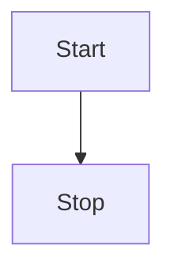
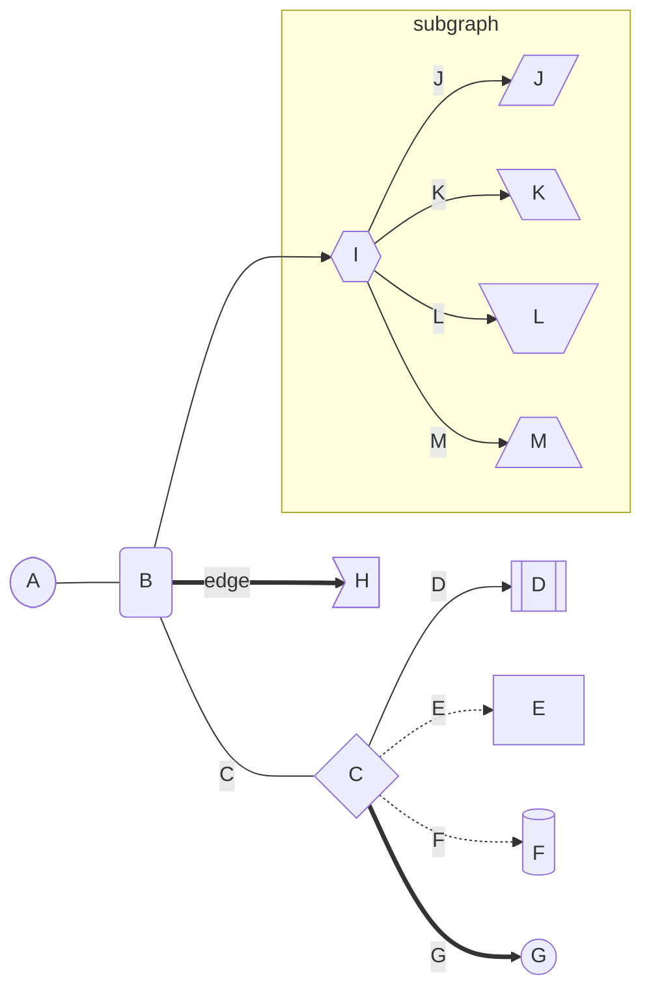
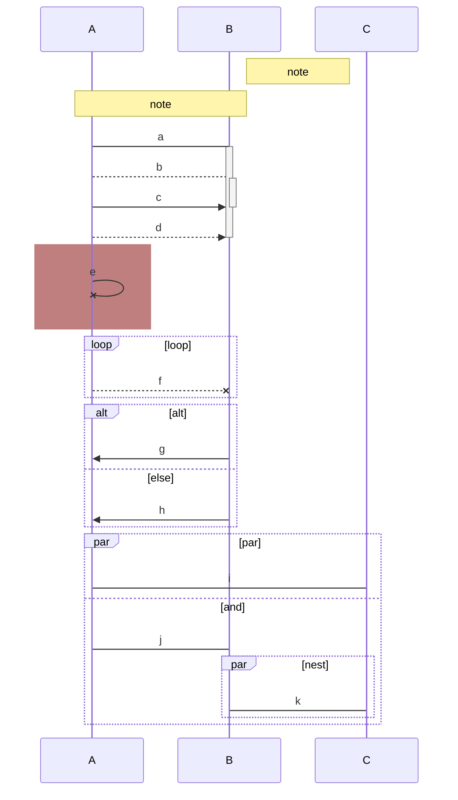
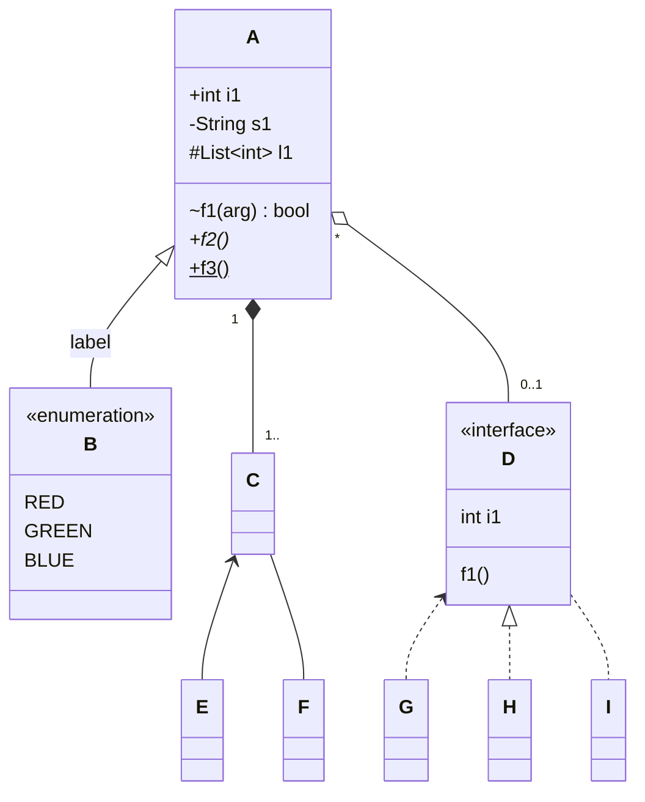
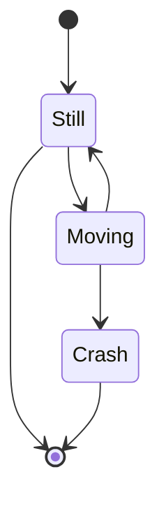
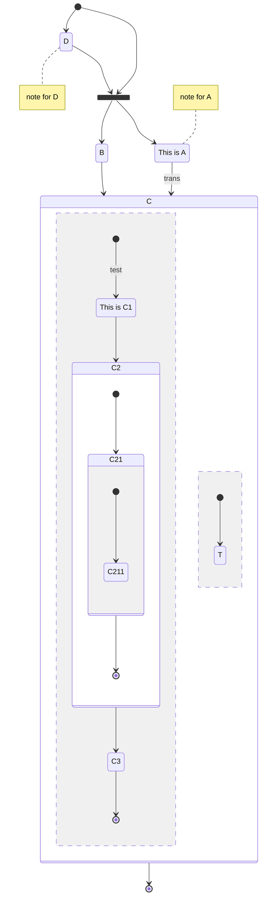
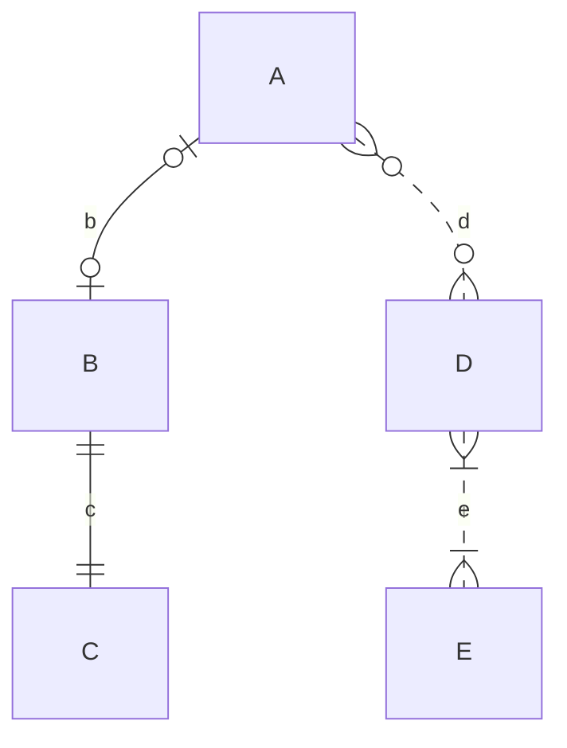
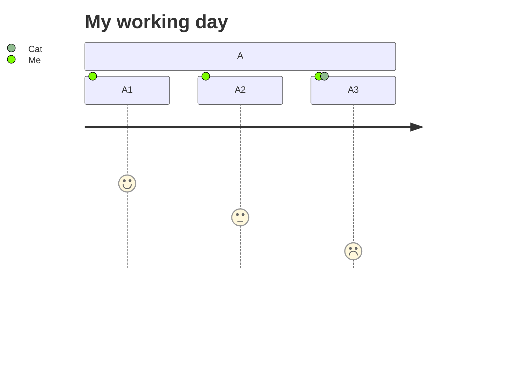
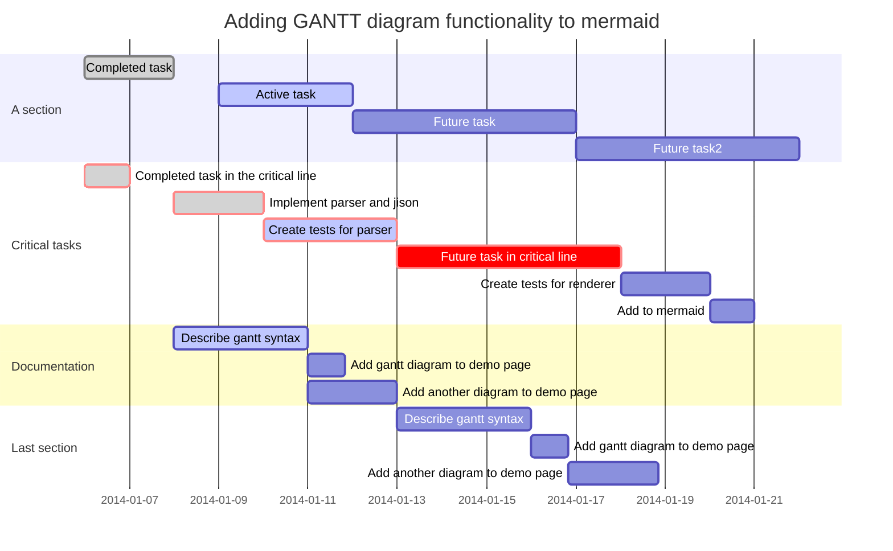
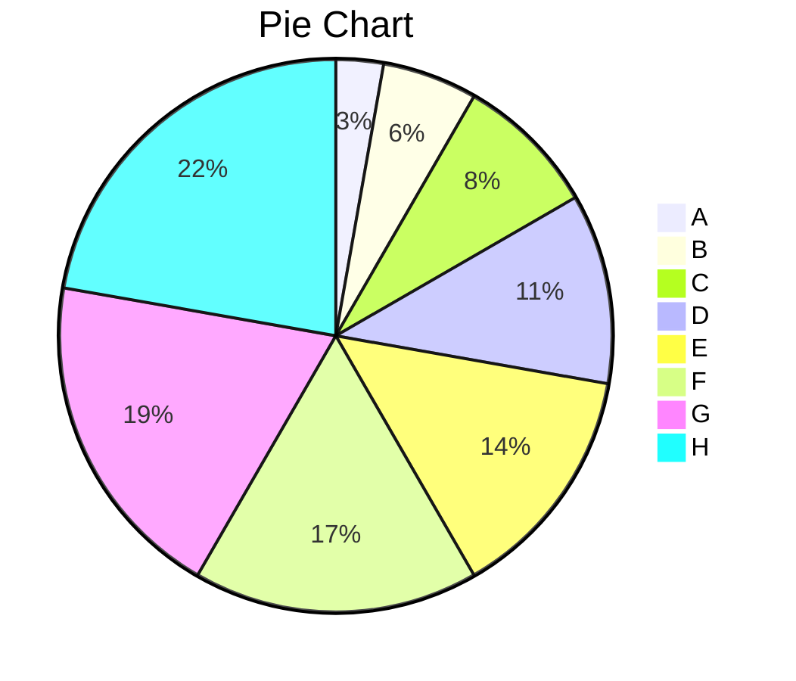

这篇文档仅作为markdown在cnblogs中的渲染效果展示。第一部分[NLNet' Samples](https://www.cnblogs.com/liwuqingxin/p/14365612.html#nlnet-samples)为自定义内容的效果展示。==NOTE== 第二、三部分的[Markdown Reference（From Typora）](https://www.cnblogs.com/liwuqingxin/p/14365612.html#markdown-reference%EF%BC%88from-typora%EF%BC%89)和[Example（From OneDark Theme for Typora）](https://www.cnblogs.com/liwuqingxin/p/14365612.html#example%EF%BC%88from-onedark-theme-for-typora%EF%BC%89)内容==非原创==，这里仅作为效果展示用。图标连源于[iconfont](https://www.iconfont.cn/)，感谢<i id="love" class="icon" size="32"> </i>！

想用这套主题吗？[传送门](https://github.com/liwuqingxin/Themes)

# NLNet' Samples

## 预设图标

预设图标主要通过css样式预设，支持hover动画，`后续将会支持持续动画`等。使用方式如下代码。==注意==，`class="icon"`不能缺少，且必须使用`</i>`作为标签结尾。另外如果希望在Typora同套主题受到较好的支持，标签内部请输入一个空格。

```html
<i id="id" class="icon"> </i>
<i id="id" class="icon" size="16"> </i>
<i id="id" class="icon" style="width:22px;height:22px"> </i>
```

目前预设支持的size有：8、12、16、20、24、32、64，其他尺寸请使用第三种方式，如dragon - 54px：<i id="dragon" class="icon" style="width:54px;height:54px"> </i>，通过css属性自行设置。支持的id有：

| id          | icon                                         | id           | icon                                          |
| :---------- | :------------------------------------------- | :----------- | :-------------------------------------------- |
| angry       | <i id="angry" class="icon" size="32"> </i>   | add          | <i id="add" class="icon" size="32"> </i>      |
| smile       | <i id="smile" class="icon" size="32"> </i>   | forbid, stop | <i id="forbid" class="icon" size="32"> </i>   |
| fine        | <i id="fine" class="icon" size="32"> </i>    | info         | <i id="info" class="icon" size="32"> </i>     |
| check, ok   | <i id="check" class="icon" size="32"> </i>   | error        | <i id="error" class="icon" size="32"> </i>    |
| uncheck     | <i id="uncheck" class="icon" size="32"> </i> | love         | <i id="love" class="icon" size="32"> </i>     |
| warn, warn1 | <i id="warn1" class="icon" size="32"> </i>   | dragon       | <i id="dragon" class="icon" size="32"> </i>   |
| warn2       | <i id="warn2" class="icon" size="32"> </i>   | cloud        | <i id="cloud" class="icon" size="32"> </i>    |
| warn3       | <i id="warn3" class="icon" size="32"> </i>   | question     | <i id="question" class="icon" size="32"> </i> |
| going       | <i id="going" class="icon" size="32"> </i>   |              |                                               |

## 类Github的徽章

使用方法：

```html
行内徽章见右边<tag>我的博客</tag><cnt>[NLNet (cnblogs)](https://www.cnblogs.com/liwuqingxin/)</cnt>我是行内徽章的小尾巴。
```

效果如下：

行内徽章见右边<tag>我的博客</tag><cnt>[NLNet (cnblogs)](https://www.cnblogs.com/liwuqingxin/)</cnt>我是行内徽章的小尾巴。

## image的alt支持的配置

| shadow       | radius   | zoom    | border  |
| :----------- | -------- | ------- | ------- |
| shadow       | radius   | zoom    | border  |
| shadow-light | radius3  | zoom25  | border0 |
|              | radius6  | zoom50  | border1 |
|              | radius9  | zoom66  | border2 |
|              | radius12 | zoom75  | border3 |
|              |          | zoom125 | border4 |
|              |          | zoom150 | border5 |
|              |          | zoom200 |         |

| 选项     | 效果                       |              |                                |
| :------- | :------------------------- | ------------ | ------------------------------ |
| shadow   |    | shadow-light |  |
| radius3  |   | border4      |       |
| radius12 |  | zoom50       |        |

# Markdown Reference（From Typora）

January 1, 2016 by typora.io

## Overview

**Markdown** is created by [Daring Fireball](http://daringfireball.net/); the original guideline is [here](http://daringfireball.net/projects/markdown/syntax). Its syntax, however, varies between different parsers or editors. **Typora** try to follow [GitHub Flavored Markdown](https://help.github.com/articles/github-flavored-markdown/), but may still have small incompatibilities.

- [Overview](https://support.typora.io/Markdown-Reference/#overview)
- Block Elements
  - [Paragraph and line breaks](https://support.typora.io/Markdown-Reference/#paragraph-and-line-breaks)
  - [Headers](https://support.typora.io/Markdown-Reference/#headers)
  - [Blockquotes](https://support.typora.io/Markdown-Reference/#blockquotes)
  - [Lists](https://support.typora.io/Markdown-Reference/#lists)
  - [Task List](https://support.typora.io/Markdown-Reference/#task-list)
  - [(Fenced) Code Blocks](https://support.typora.io/Markdown-Reference/#fenced-code-blocks)
  - [Math Blocks](https://support.typora.io/Markdown-Reference/#math-blocks)
  - [Tables](https://support.typora.io/Markdown-Reference/#tables)
  - [Footnotes](https://support.typora.io/Markdown-Reference/#footnotes)
  - [Horizontal Rules](https://support.typora.io/Markdown-Reference/#horizontal-rules)
  - [YAML Front Matter](https://support.typora.io/Markdown-Reference/#yaml-front-matter)
  - [Table of Contents (TOC)](https://support.typora.io/Markdown-Reference/#table-of-contents-toc)
- Span Elements
  - Links
    - [Inline Links](https://support.typora.io/Markdown-Reference/#inline-links)
    - [Internal Links](https://support.typora.io/Markdown-Reference/#internal-links)
    - [Reference Links](https://support.typora.io/Markdown-Reference/#reference-links)
  - [URLs](https://support.typora.io/Markdown-Reference/#urls)
  - [Images](https://support.typora.io/Markdown-Reference/#images)
  - [Emphasis](https://support.typora.io/Markdown-Reference/#emphasis)
  - [Strong](https://support.typora.io/Markdown-Reference/#strong)
  - [Code](https://support.typora.io/Markdown-Reference/#code)
  - [Strikethrough](https://support.typora.io/Markdown-Reference/#strikethrough)
  - [Emoji :happy:](https://support.typora.io/Markdown-Reference/#emoji-happy)
  - [Inline Math](https://support.typora.io/Markdown-Reference/#inline-math)
  - [Subscript](https://support.typora.io/Markdown-Reference/#subscript)
  - [Superscript](https://support.typora.io/Markdown-Reference/#superscript)
  - [Highlight](https://support.typora.io/Markdown-Reference/#highlight)
- HTML
  - [Underlines](https://support.typora.io/Markdown-Reference/#underlines)
  - [Embed Contents](https://support.typora.io/Markdown-Reference/#embed-contents)
  - [Video](https://support.typora.io/Markdown-Reference/#video)
  - [Other HTML Support](https://support.typora.io/Markdown-Reference/#other-html-support)

## Block Elements

### Paragraph and line breaks

A paragraph is simply one or more consecutive lines of text. In markdown source code, paragraphs are separated by two or more blank lines. In Typora, you only need one blank line (press `Return` once) to create a new paragraph.

Press `Shift` + `Return` to create a single line break. Most other markdown parsers will ignore single line breaks, so in order to make other markdown parsers recognize your line break, you can leave two spaces at the end of the line, or insert `<br/>`.

### Headers

Headers use 1-6 hash (`#`) characters at the start of the line, corresponding to header levels 1-6. For example:

```
# This is an H1

## This is an H2

###### This is an H6
```

In Typora, input ‘#’s followed by title content, and press `Return` key will create a header. Or type ⌘1 to ⌘6 as a shortcut.

### Blockquotes

Markdown uses email-style > characters for block quoting. They are presented as:

```
> This is a blockquote with two paragraphs. This is first paragraph.
>
> This is second pragraph. Vestibulum enim wisi, viverra nec, fringilla in, laoreet vitae, risus.


> This is another blockquote with one paragraph. There is three empty line to seperate two blockquote.
```

In Typora, typing ‘>’ followed by your quote contents will generate a quote block. Typora will insert a proper ‘>’ or line break for you. Nested block quotes (a block quote inside another block quote) by adding additional levels of ‘>’.

### Lists

Typing `* list item 1` will create an unordered list. (The `*` symbol can be replace with `+` or `-`.)

Typing `1. list item 1` will create an ordered list.

For example:

```
## un-ordered list
*   Red
*   Green
*   Blue

## ordered list
1.  Red
2. 	Green
3.	Blue
```

### Task List

Task lists are lists with items marked as either [ ] or [x] (incomplete or complete). For example:

```
- [ ] a task list item
- [ ] list syntax required
- [ ] normal **formatting**, @mentions, #1234 refs
- [ ] incomplete
- [x] completed
```

You can change the complete/incomplete state by clicking on the checkbox before the item.

### (Fenced) Code Blocks

Typora only supports fences in GitHub Flavored Markdown, not the original code block style.

Using fences is easy: type ``` and press `return`. Add an optional language identifier after ``` and Typora runs it through syntax highlighting:

```
Here's an example:

​```
function test() {
  console.log("notice the blank line before this function?");
}
​```

syntax highlighting:
​```ruby
require 'redcarpet'
markdown = Redcarpet.new("Hello World!")
puts markdown.to_html
​```
```

### Math Blocks

You can render *LaTeX* mathematical expressions using **MathJax**.

To add a mathematical expression, enter `$$` and press the ‘Return’ key. This will trigger an input field which accepts *Tex/LaTex* source. For example:

V1×V2=∣∣∣∣∣i∂X∂u∂X∂vj∂Y∂u∂Y∂vk00∣∣∣∣∣V1×V2=|ijk∂X∂u∂Y∂u0∂X∂v∂Y∂v0|

In the markdown source file, the math block is a *LaTeX* expression wrapped by a pair of ‘$$’ marks:

```
$$
\mathbf{V}_1 \times \mathbf{V}_2 =  \begin{vmatrix}
\mathbf{i} & \mathbf{j} & \mathbf{k} \\
\frac{\partial X}{\partial u} &  \frac{\partial Y}{\partial u} & 0 \\
\frac{\partial X}{\partial v} &  \frac{\partial Y}{\partial v} & 0 \\
\end{vmatrix}
$$
```

You can find more details [here](http://support.typora.io/Math/).

### Tables

Standard Markdown has been extended in several ways to add table support., including by GFM. Typora supports this with a graphical interface, or writing the source code directly.

Enter `| First Header | Second Header |` and press the `return` key. This will create a table with two columns.

After a table is created, placing the focus on that table will open up a toolbar for the table where you can resize, align, or delete the table. You can also use the context menu to copy and add/delete individual columns/rows.

The full syntax for tables is described below, but it is not necessary to know the full syntax in detail as the markdown source code for tables is generated automatically by Typora.

In markdown source code, they look like:

```
| First Header  | Second Header |
| ------------- | ------------- |
| Content Cell  | Content Cell  |
| Content Cell  | Content Cell  |
```

You can also include inline Markdown such as links, bold, italics, or strikethrough in the table.

By including colons (`:`) within the header row, you can set text in that column to be left-aligned, right-aligned, or center-aligned:

```
| Left-Aligned  | Center Aligned  | Right Aligned |
| :------------ |:---------------:| -----:|
| col 3 is      | some wordy text | $1600 |
| col 2 is      | centered        |   $12 |
| zebra stripes | are neat        |    $1 |
```

A colon on the left-most side indicates a left-aligned column; a colon on the right-most side indicates a right-aligned column; a colon on both sides indicates a center-aligned column.

### Footnotes

MultiMarkdown extends standard Markdown to provide two ways to add footnotes.

You can create **reference footnotes** like this[1](https://support.typora.io/Markdown-Reference/#fn:fn1) and this[2](https://support.typora.io/Markdown-Reference/#fn:fn2).

will produce:

```
You can create footnotes like this[^fn1] and this[^fn2].

[^fn1]: Here is the *text* of the first **footnote**.
[^fn2]: Here is the *text* of the second **footnote**.
```

Hover over the ‘fn1’ or ‘fn2’ superscript to see content of the footnote. You can use whatever unique identified you like as the footnote marker (e.g. “fn1”).

Hover over the footnote superscripts to see content of the footnote.

### Horizontal Rules

Entering `***` or `---` on a blank line and pressing `return` will draw a horizontal line.

------

### YAML Front Matter

Typora now supports [YAML Front Matter](http://jekyllrb.com/docs/frontmatter/). Enter `---` at the top of the article and then press `Return` to introduce a metadata block. Alternatively, you can insert a metadata block from the top menu of Typora.

### Table of Contents (TOC)

Enter `[toc]` and press the `Return` key to create a “Table of Contents” section. The TOC extracts all headers from the document, and its contents are updated automatically as you add to the document.

## Span Elements

Span elements will be parsed and rendered right after typing. Moving the cursor in middle of those span elements will expand those elements into markdown source. Below is an explanation of the syntax for each span element.

### Links

Markdown supports two styles of links: inline and reference.

In both styles, the link text is delimited by [square brackets].

#### Inline Links

To create an inline link, use a set of regular parentheses immediately after the link text’s closing square bracket. Inside the parentheses, put the URL where you want the link to point, along with an optional title for the link, surrounded in quotes. For example:

```
This is [an example](http://example.com/ "Title") inline link.

[This link](http://example.net/) has no title attribute.
```

will produce:

This is [an example](http://example.com/"Title") inline link. (`<p>This is <a href="http://example.com/" title="Title">`)

[This link](http://example.net/) has no title attribute. (`<p><a href="http://example.net/">This link</a> has no`)

#### Internal Links

To create an internal link that creates a ‘bookmark’ that allow you to jump to that section after clicking on it, use the name of the header element as the href. For example:

Hold down Cmd (on Windows: Ctrl) and click on [this link](https://support.typora.io/Markdown-Reference/#block-elements) to jump to header `Block Elements`.

```
Hold down Cmd (on Windows: Ctrl) and click on [this link](#block-elements) to jump to header `Block Elements`. 
```

#### Reference Links

Reference-style links use a second set of square brackets, inside which you place a label of your choosing to identify the link:

```
This is [an example][id] reference-style link.

Then, anywhere in the document, you define your link label on a line by itself like this:

[id]: http://example.com/  "Optional Title Here"
```

In Typora, they will be rendered like so:

This is [an example](http://example.com/) reference-style link.

The implicit link name shortcut allows you to omit the name of the link, in which case the link text itself is used as the name. Just use an empty set of square brackets — for example, to link the word “Google” to the google.com web site, you could simply write:

```
[Google][]
And then define the link:

[Google]: http://google.com/
```

In Typora, clicking the link will expand it for editing, and command+click will open the hyperlink in your web browser.

### URLs

Typora allows you to insert URLs as links, wrapped by `<`brackets`>`. For example `<i@typora.io>` becomes [i@typora.io](mailto:i@typora.io).

Typora will also automatically link standard URLs (for example: www.google.com) without these brackets.

### Images

Images have similar syntax as links, but they require an additional `!` char before the start of the link. The syntax for inserting an image looks like this:

```


```

You are able to use drag and drop to insert an image from an image file or your web browser. You can modify the markdown source code by clicking on the image. A relative path will be used if the image that is added using drag and drop is in same directory or sub-directory as the document you’re currently editing.

If you’re using markdown for building websites, you may specify a URL prefix for the image preview on your local computer with property `typora-root-url` in YAML Front Matter. For example, Enter `typora-root-url:/User/Abner/Website/typora.io/` in YAML Front Matter, and then `` will be treated as `` in Typora.


### Emphasis

Markdown treats asterisks (`*`) and underscores (`_`) as indicators of emphasis. Text wrapped with one `*` or `_` will be wrapped with an HTML `<em>` tag. For example:

```
*single asterisks*

_single underscores_
```

produces:

*single asterisks*

*single underscores*

GFM will ignore underscores in words, which is commonly used in code and names, like this:

> wow_great_stuff
>
> do_this_and_do_that_and_another_thing.

To produce a literal asterisk or underscore at a position where it would otherwise be used as an emphasis delimiter, you can backslash escape it with a backslash character:

```
\*this text is surrounded by literal asterisks\*
```

Typora recommends using the `*` symbol.

### Strong

A double `*` or `_` will cause its enclosed contents to be wrapped with an HTML `<strong>` tag, e.g:

```
**double asterisks**

__double underscores__
```

produces:

**double asterisks**

**double underscores**

Typora recommends using the `**` symbol.

### Code

To indicate an inline span of code, wrap it with backtick quotes (`). Unlike a pre-formatted code block, a code span indicates code within a normal paragraph. For example:

```
Use the `printf()` function.
```

will produce:

Use the `printf()` function.

### Strikethrough

GFM adds syntax to create strikethrough text, which is missing from standard Markdown.

`~~Mistaken text.~~` becomes ~~Mistaken text.~~

### Emoji :happy:

Enter emoji with syntax `:smile:`. To make it easier, an auto-complete helper will pop up after typing `:` and the start of an emoji name.

Entering UTF-8 emoji characters directly is also supported by going to `Edit` -> `Emoji & Symbols` in the menu bar.

### Inline Math

To use this feature, please enable it first in the `Markdown` tab of the preference panel. Then, use `$` to wrap a LaTeX command. For example: `$\lim_{x \to \infty} \exp(-x) = 0$`.

To trigger inline preview for inline math: input “$”, then press the `ESC` key, then input a TeX command.

You can find more details [here](http://support.typora.io/Math/).

### Subscript

To use this feature, please enable it first in the `Markdown` tab of the preference panel. Then, use `~` to wrap subscript content. For example: `H~2~O`, `X~long\ text~`/

### Superscript

To use this feature, please enable it first in the `Markdown` tab of the preference panel. Then, use `^` to wrap superscript content. For example: `X^2^`.

### Highlight

To use this feature, please enable it first in the `Markdown` tab of the preference panel. Then, use `==` to wrap highlight content. For example: `==highlight==`.

==highlight==

## HTML

You can use HTML to style content what pure Markdown does not support. For example, use `<span style="color:red">this text is red</span>` to add text with red color.

### Underlines

Underline isn’t specified in Markdown of GFM, but can be produced by using underline HTML tags:

`<u>Underline</u>` becomes Underline.

### Embed Contents

Some websites provide iframe-based embed code which you can also paste into Typora. For example:

```Markdown
<iframe height='265' scrolling='no' title='Fancy Animated SVG Menu' src='http://codepen.io/jeangontijo/embed/OxVywj/?height=265&theme-id=0&default-tab=css,result&embed-version=2' frameborder='no' allowtransparency='true' allowfullscreen='true' style='width: 100%;'></iframe>
```

### Video

You can use the `<video>` HTML tag to embed videos. For example:

```Markdown
<video src="xxx.mp4" />
```

### Other HTML Support

You can find more details [here](http://support.typora.io/HTML/).

1. Here is the *text* of the first **footnote**. [↩](https://support.typora.io/Markdown-Reference/#fnref:fn1)
2. Here is the *text* of the second **footnote**. [↩](https://support.typora.io/Markdown-Reference/#fnref:fn2)

hosted on [Github](https://github.com/typora/wiki-website).


# Example（From OneDark Theme for Typora）

[toc]

## Headers

### h3

Markdown is a lightweight markup language with plain-text-formatting syntax. Its design allows it to be converted to many output formats, but the original tool by the same name only supports HTML. Markdown is often used to format readme files, for writing messages in online discussion forums, and to create rich text using a plain text editor.

#### h4

Since the initial description of Markdown contained ambiguities and unanswered questions, the implementations that appeared over the years have subtle differences and many come with syntax extensions.

##### h5

In MediaWiki, it is implemented in the currently unmaintained MarkdownExtraParser parser function extension

###### h6

Implementations of Markdown are available for over a dozen programming languages.

## Quote

> Most UI components including tooltip, dialog and buttons are painted by HTML. And you only need to change those part when you find the UI components are incompatible with your editor theme after finishing steps above. HTML files from the toolkit includes most common UI components for you to easily debug.

## Font Style

**Bold**, *italic*, ~~delete~~

<u>underline</u>, [Link](typora.io)

H~2~O, E=mc^2^

<span style="color:red">colored text</span>, ==highlight==

emoji: :smile:

- [x] checkbox

## Codeblock

```python
# hello_world.py
class HelloWorld():
	def __init__(self):
        self.text='hello world!'
    
    def show(self,word):
        print(f'{word}, {self.text}')
        
test=HelloWorld()
test.show()
```

Run terminal then enter: `python hello_world.py`

## KBD

* bold：<kbd>Ctrl/Command</kbd> + <kbd>B</kbd> 

* italic：<kbd>Ctrl/Command</kbd> + <kbd>I</kbd> 

## MathJax

Given two populations, $x_1$ and $x_2$ , with logistic dynamics, the Lotka–Volterra formulation adds an additional term to account for the species' interactions. Thus the competitive Lotka–Volterra equations are:
$$
\begin{cases}
\cfrac{dx_1}{dt}=r_1x_1\bigg(1-\cfrac{x_1+\alpha_{12} x_2}{K_1}\bigg)\\ 
\cfrac{dx_2}{dt}=r_2x_2\bigg(1-\cfrac{x_2+\alpha_{21} x_1}{K_2}\bigg)
\end{cases}
$$
Here, $\alpha_{12}$ represents the effect species 2 has on the population of species 1 and  $\alpha_{21}$represents the effect species 1 has on the population of species 2. 

## Order

1. first item
2. second item
   1. first item
   2. second item
3. third item

---

* first item
* second item
  * first item
    * first item
* fourth item

## Table

| Cinderella   |   11 | glass       | transparent |
| :----------- | ---: | :---------- | :---------- |
| Name         | Size | Material    | Color       |
| All Business |    9 | leather     | brown       |
| Roundabout   |   10 | hemp canvas | natural     |

## Footnote

You can create footnotes like this[^fn1] and this[^fn2]. 

[^fn1]: Here is the **text** of the first ***\*footnote\****. 
[^fn2]: Here is the **text** of the second ***\*footnote\****.

## Image, Video


<video src="https://cdn.jsdelivr.net/gh/liwuqingxin/nlnet-blogs@main/src/2020/imgs/0012.mp4" />

<table>
  <tr>
   <td>Bash command
   </td>
   <td>Description
   </td>
  </tr>
  <tr>
   <td>ls
   </td>
   <td>List directory contents
   </td>
  </tr>
  <tr>
   <td>cd
   </td>
   <td>Change directory
   </td>
  </tr>
  <tr>
   <td>cp
   </td>
   <td>Copy files
   </td>
  </tr>
  <tr>
   <td>mv
   </td>
   <td>Move files
   </td>
  </tr>
</table>


## Graph

### sequence

```sequence
Alice->Bob: Hello Bob, how are you?
Note right of Bob: Bob thinks
Bob-->Alice: I am good thanks!
```

### flow

```flow
st=>start: Start
op=>operation: Your Operation
cond=>condition: Yes or No?
e=>end

st->op->cond
cond(yes)->e
cond(no)->op
```

### mermaid

#### Flowchart






#### Sequence diagram



#### Class diagram



#### State diagram






#### Entity Relationship Diagram



#### User Journey Diagram



#### Gantt



#### Pie Chart

